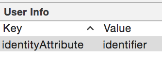
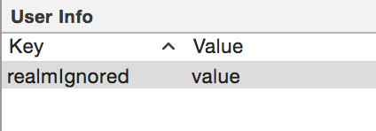
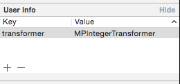

# DBGenerator

DBGenerator is a tool to generate [Realm](https://realm.io) model classes, for both Android (Java) and iOS/macOS (ObjC & Swift), from an `.xcdatamodel` file.

---


## Introduction

The `.xcdatamodel` file is usually used to represent Core Data entities in Xcode in a graphical way. It can be created or edited with a graphical user interface in Xcode.

But with DBGenerator, you will now be able to **use an `xcdatamodel` to create a [Realm](https://realm.io) model files as well!**

This will allow you to design your model in a visual way (rather than by code), only once (rather than once for Android and once for iOS), and have the code generated for you.


The `.xcdatamodel` file is the input of the script.


## License

This tool is under [the Apache 2 License](LICENSE).

It has been initially developed by [Niji](http://www.niji.fr) and is in no way affiliated to the [Realm](https://realm.io) company.


## Installation

Simply clone this repository anywhere you want on your machine, then run the `bin/dbgenerator` ruby script with the appropriate options (see below). For example:

```
~/Dev/DBGenerator/bin/dbgenerator -m <model> --ios ~/Dev/MyProject/RealmModel --swift
```


## Command line arguments

DBGenerator is a command line tool. The available parameters are as follows. You can also use `-h` do display the usage and available parameters/flags in the Terminal of course.

| Short flag | Long flag | Description | Android | iOS |
| ---------- | --------- | ----------- |:-------:|:---:|
| `-m` | `--model` | Path to the  `.xcdatamodel` file. If this parameter is not given, DBGenerator will look for a `.xcdatamodel` | ✅ | ✅ |
| `-a` | `--android` | Path to the directory where the generated files for Android will be created (eg : home/documents/dev/android/realm_project/com/niji/data) | ✅ | ➖ |
| `-p` | `--package` | Full name of the Android "data" package (eg : com.niji.data) | ✅ | ➖ |
| `-i` | `--ios` | Path to the directory where the generated files for iOS/macOS will be created | ➖ | ✅ |
| `-j` | `--json` | Creates the Realm-JSON categories (https://github.com/matthewcheok/Realm-JSON) | ➖ | ☑️ |
| `-f` | `--framework` | Tells whether the project uses CocoaPods Frameworks  | ➖ | ☑️ |
| `-s` | `--swift` | Use Swift for the iOS/macOS generation | ➖ | ☑️ |
| `-n` | `--nsnumber` | Generate `NSNumber`s instead of Int/BOOL/Float types | ➖ | ☑️ |
| `-w` | `--wrappers` | Use type wrappers for Java (Integer, Double,...) for optional attributes instead of primitive types (int, double...) | ☑️ | ➖ |
| `-x` | `--annotations` | Annotate the getters/setters of the generated classes with `@Nullable` for any optional attribute/relationship, and with `@NonNull` for any non-optional attribute/relationship | ☑️ | ➖ |
| `-h` | `--help` | Prints help | ☑️ | ☑️ |
| `-v` | `--version` | Prints the current version number of DBGenerator | ☑️ | ☑️ |

_Caption: ✅ Mandatory flag for this platform / ☑️ Optional flag usable for this platform / ➖ Not applicable for ths platform_


## Annotating your `xcdatamodel`

The `.xcdatamodel` Xcode editor allows you to add "user infos" to your entities, attributes or relationships. Each "user info" entry is an arbitrary key/value pair.

_To define a User Info key in Xcode's xcdatamodel editor, select the entity or attribute you want to add a User Info to, then select the 3rd tab in the inspector on the right ("Data Model Inspector", or Cmd-Alt-3), and fill the information you want in the "User Info" section there._

With the help of these "user infos", you will be able to give DBGenerator extra information about your model classes. For example, you can tell which attribute is the primary key, the attributes to ignore, the JSON mappings, ...

Below are details about how to annotate your `xcdatamodel` entities and attributes to be able to leverage each Realm features when generating your Realm models with DBGenerator.


---


### Primary key

To tell which attribute will be used as a primary key, add the following 'user info' to **the entity**:

| Key | Value |
|-----|-------|
| `identityAttribute` | `name_of_the_attribute` |


__Example__: On the "FidelityCard" entity:




<details>
<summary>📑 Sample of the generated code in Java (Android)</summary>

```java
package com.niji.data;

import io.realm.RealmObject;
import io.realm.annotations.PrimaryKey;

/* DO NOT EDIT | Generated by dbgenerator */

public class FidelityCard extends RealmObject {

    @PrimaryKey
    private short identifier;
    private int points;
    private User user;
	[...]
}
```
</details>

<details>
<summary>📑 Sample of the generated code in Objective-C (iOS)</summary>

```objc
// DO NOT EDIT | Generated by dbgenerator

////////////////////////////////////////////////////////////////////////////////

#pragma mark - Imports

#import "RLMFidelityCard.h"

////////////////////////////////////////////////////////////////////////////////

#pragma mark - Implementation

@implementation RLMFidelityCard

#pragma mark - Superclass Overrides

+ (NSString *)primaryKey
{
    return @"identifier";
}

@end
```
</details>


---


### Ignore attribute

You can decide to ignore some attributes of the `.xcdatamodel` file. They will not be persisted to Realm. To do so, add the following 'user info' to **the attribute**:

| Key | Value |
|-----|-------|
| `realmIgnored` | `value` |


__Example__: on the attribute `ignored` of the entity `Shop`:




<details>
<summary>📑 Sample of the generated code in Java (Android)</summary>

```java
package com.niji.data;

import io.realm.RealmList;
import io.realm.RealmObject;
import io.realm.annotations.Ignore;

/* DO NOT EDIT | Generated by dbgenerator */

public class Shop extends RealmObject {

    private String name;
    private String readOnly;
    private RealmList<Product> products;
    @Ignore
    private String ignored;
    [...]
}
```
</details>

<details>
<summary>📑 Sample of the generated code in Objective-C (iOS)</summary>

```objc
// DO NOT EDIT | Generated by dbgenerator

////////////////////////////////////////////////////////////////////////////////

#pragma mark - Imports

#import "RLMShop.h"

////////////////////////////////////////////////////////////////////////////////

#pragma mark - Implementation

@implementation RLMShop

#pragma mark - Superclass Overrides

// Specify properties to ignore (Realm won't persist these)
+ (NSArray *)ignoredProperties
{
    return @[@"ignored"];
}
@end
```
</details>


---


### Read only

On iOS/macOS, you can define attributes which are not persisted and whose value is computed dynamically.
To do so, add the following 'user info' to **the attribute**

| Key | Value |
|-----|-------|
| `realmReadOnly` | `the_code_source_to_generate` |


__Example__: On the `readOnly`  attribute of the `Shop`  entity:


<details>
<summary>📑 Sample of the generated code in Objective-C (iOS)</summary>

```objc
// DO NOT EDIT | Generated by dbgenerator

////////////////////////////////////////////////////////////////////////////////

#pragma mark - Imports

#import "RLMShop.h"

////////////////////////////////////////////////////////////////////////////////

#pragma mark - Implementation

@implementation RLMShop

#pragma mark - Superclass Overrides

- (NSString *)readOnly
{
    return self.name;
}

@end
```
</details>


---


### Inverse Relationships

In realm, when you have both A -> B and B -> A relationships, you have to choose one of those relationships to be the primary one (e.g. A -> B) — that will be stored in Realm — and the other inverse relationship will then be **computed** by code. [For more information, see the related RealmSwift documentation on Inverse Relationships](https://realm.io/docs/swift/latest/#inverse-relationships).

To mark a relationship as being an inverse relationship (the B -> A relationship and not the primary A -> B one), the convention in `dbgenerator` is to **suffix the name of the relationship with an underscore `_`** .

This will then generate the following code in Swift for that inverse relationship:

```swift
LinkingObjects(fromType: A.self, property: "b")`
```

If your inverse relationship is defined to point to a unique object (inverse of a `1-*` relationship for exemple, and not a `*-*` one), the generated code will contain both the plural form of the computed variable and a singular form returning its first element, for convenience:

```swift
let owners = LinkingObjects(fromType: Person.self, property: "dogs")`
var owner: Person? { return owners.first }
```


---


### Champs optionnels et wrapper types

Sur Android, le flag de génération `-w` ou `--wrappers` permet de générer les champs marqué comme optionnels avec des wrapper-types en lieu et place des types primitifs.

<details>
<summary>📑 Sample of the generated code in Java (Android)</summary>

```java
package com.niji.data;

import io.realm.RealmObject;
import io.realm.annotations.PrimaryKey;

/* DO NOT EDIT | Generated by dbgenerator */

public class FidelityCard extends RealmObject {

    @PrimaryKey
    private short identifier;   // case "optional" non cochée dans le xcdatamodel
    private Integer points;     // case "optional" cochée dans le xcdatamodel
    private User user;
	[...]
}
```
</details>


---


### Annotations de support

Sur Android, le flag `-x` ou `--annotations` permet de marquer les getters et setters des attributs de classe avec les annotations `@Nullable` si l'attribut est optionnel, ou `@NonNull` s'il ne l'est pas.
Cette option peut être combinée avec celle des wrappers pour obtenir un code qui soit le plus sécurisé à l'utilisation dans Android Studio.

<details>
<summary>📑 Sample of the generated code in Java (Android)</summary>

```java
package com.niji.data;

import io.realm.RealmObject;
import io.realm.annotations.PrimaryKey;

/* DO NOT EDIT | Generated by dbgenerator */

public class FidelityCard extends RealmObject {

    @PrimaryKey
    private short identifier;   // case "optional" non cochée dans le xcdatamodel
    private Integer points;     // case "optional" cochée dans le xcdatamodel
    private User user;
	[...]

	@android.support.annotation.Nullable
	public Integer getPoints() {
	    return points;
	}

	public void setPoints(@android.support.annotation.Nullable final Integer points) {
	    this.points = points;
	}

}
```
</details>

De plus, il est possible d'ajouter des annotations personnalisées à vos champs. Pour cela, il faut ajouter la paire clévaleur suivante à l'attribut à annoter:

| Key | Value |
|-----|-------|
| `supportAnnotation` | `AnnotationAAjouter` |


__Exemple__: Si l'on veut rajouter l'annotation `IntRange(from=0,to=255)`:


<details>
<summary>📑 Sample of the generated code in Java (Android)</summary>

```java
package fr.ganfra.realm;

import io.realm.RealmObject;

/* DO NOT EDIT | Generated by dbgenerator */

public class FidelityCard extends RealmObject {

    public interface Attributes {
        String IDENTIFIER = "identifier";
        String POINTS = "points";
    }

    private short identifier;
    @android.support.annotation.IntRange(from=0,to=255)
    private int points;

    public short getIdentifier() {
        return identifier;
    }

    public void setIdentifier(final short identifier) {
        this.identifier = identifier;
    }

    @android.support.annotation.IntRange(from=0,to=255)
    public int getPoints() {
        return points;
    }

    public void setPoints(@android.support.annotation.IntRange(from=0,to=255) final int points) {
        this.points = points;
    }
}
```
</details>


---


### Managing enums

Sometimes, an `Int` attribute represents an enum member. To deal with this case, you will have to add the following two key/value pairs to the **attribute**:

| Key | Value |
|-----|-------|
| `enumType` | `my_type` |
| `enumValues` | `my_value_1, my_value_2, my_value_3` |

__Example__: On the attribute `type` of the `Shop` entity.


<details>
<summary>📑 Sample of the generated code in Java (Android)</summary>

`Shop.java`:

```java
package com.niji.data;

import io.realm.RealmObject;

/* DO NOT EDIT | Generated by dbgenerator */

public class Shop extends RealmObject {

    private String name;
    private Type type;
	[...]
}
```

`Type.java`:

```java
package com.niji.data;

/* DO NOT EDIT | Generated by dbgenerator */

public enum Type {

    TYPE_ONE,
    TYPE_TWO,
    TYPE_THREE
}
```
</details>

<details>
<summary>📑 Sample of the generated code in Objective-C (iOS)</summary>

`RLMShop.h`:

```objc
// DO NOT EDIT | Generated by dbgenerator

////////////////////////////////////////////////////////////////////////////////

#pragma mark - Imports

#import <Realm/Realm.h>
#import "RLMTypes.h"

////////////////////////////////////////////////////////////////////////////////

#pragma mark - Interface

@interface RLMShop : RLMObject

#pragma mark - Properties

@property NSString *name;
@property RLMType type;

@end
```

`RLMTypes.h`:

```objc
// DO NOT EDIT | Generated by dbgenerator

////////////////////////////////////////////////////////////////////////////////

#pragma mark - Types

typedef NS_ENUM(int, RLMType) {
    RLMTypeOne = 0,
    RLMTypeTwo,
    RLMTypeThree
};
```
</details>

<details>
<summary>📑 Sample of the generated code in Swift (iOS)</summary>

`Shop.swift`:

```swift
/* DO NOT EDIT | Generated by dbgenerator */

import RealmSwift

final class Shop: Object {

    enum Attributes: String {
        case Name = "name"
        case OptionalValue = "optionalValue"
        case Type = "type"
    }

    dynamic var name: String = ""
    dynamic var optionalValue: String? = nil
    var optionalValueEnum: OptValue? {
        get {
            guard let optionalValue = optionalValue,
              let enumValue = OptValue(rawValue: optionalValue)
              else { return nil }
            return enumValue
        }
        set { optionalValue = newValue?.rawValue ?? nil }
    }

    dynamic var type: String = ""
    var typeEnum: Type? {
        get {
            guard let enumValue = Type(rawValue: type) else { return nil }
            return enumValue
        }
        set { type = newValue?.rawValue ?? "" }
    }
}
```

`Type.swift`:

```swift
/* DO NOT EDIT | Generated by dbgenerator */

enum Type: String {
    case TypeOne = "type_one"
    case TypeTwo = "type_two"
    case TypeThree = "type_three"
}
```

`OptValue.swift`

```swift
/* DO NOT EDIT | Generated by dbgenerator */

enum OptValue: String {
    case OptValueOne = "opt_value_one"
    case OptValueTwo = "opt_value_two"
    case OptValueThree = "opt_value_three"
}
```
</details>

> **Note**: For Android and Swift, each enum is created in a separate file. For ObjC, all the enums are created in the file RLMTypes.h


---


### Commenter les classes

A des fins de clareté, il est possible de rajouter un commentaire sur une entité, pour permettre de fournir une petite description du rôle de cet entité par exemple.

Pour cela, il suffit de rajouter la paire clé-valeur suivante à votre **entité** du xcdatamodel.:

| Key | Value |
|-----|-------|
| `comment` | `texte_du_commentaire` |

Un commentaire de code (`/** … */`) sera généré dans le `.h` (iOS) ou le `.java` (Android) juste avant la déclaration de la classe, pour aider le développeur à comprendre son but en relisant le doc (ou s'il générait la documentation Javadoc/Doxygen).


---


### Mapping json

Vous pouvez également ajouter la correspondance json pour chaque **attribut** ou **relationship** avec la paire clé-valeur suivante :

| Key | Value |
|-----|-------|
| `JSONKeyPath` | `valeur_json` |


__Exemple__: Sur l'attribut 'name' de l'entité 'Shop'


<details>
<summary>📑 Sample of the generated code in Java (Android)</summary>

Sur Android, nous utilisons la librairie GSON

```java
package com.niji.data;

import com.google.gson.annotations.SerializedName;

import io.realm.RealmList;
import io.realm.RealmObject;

/* DO NOT EDIT | Generated by dbgenerator */

public class Shop extends RealmObject {

    @SerializedName("json_name")
    private String name;
    private RealmList<Product> products;
	[...]
}
```
</details>

<details>
<summary>📑 Sample of the generated code in Objective-C (iOS)</summary>

Sur iOS nous utilisons la librairie Realm-JSON en génèrant les catégories MonEntité+JSON

`RLMShop+JSON.m`: 

```objc
// DO NOT EDIT | Generated by dbgenerator

////////////////////////////////////////////////////////////////////////////////

#pragma mark - Imports

#import "RLMShop+JSON.h"

////////////////////////////////////////////////////////////////////////////////

#pragma mark - Implementation

@implementation RLMShop (JSON)

+ (NSDictionary *)JSONInboundMappingDictionary
{
    return @{
        @"json_name" : @"name"
    };
}

+ (NSDictionary *)JSONOutboundMappingDictionary
{
    return @{
        @"name" : @"json_name"
    };
}

@end
```
</details>

Cela fonctionne également avec les enum (voir "Gérer les eums" plus haut):

| Key | Value |
|-----|-------|
| `JSONValues` | `valeur_json_1,valeur_json_2,valeur_json_3` |


__Exemple__:


<details>
<summary>📑 Sample of the generated code in Java (Android)</summary>

```java
package com.niji.data;

import com.google.gson.annotations.SerializedName;

/* DO NOT EDIT | Generated by dbgenerator */

public enum Type {

    @SerializedName("json_type_one")TYPE_ONE,
    @SerializedName("json_type_two")TYPE_TWO,
    @SerializedName("json_type_three")TYPE_THREE
}
```
</details>

<details>
<summary>📑 Sample of the generated code in Objective-C (iOS)</summary>

`RLMShop+JSON.m`:

```objc
// DO NOT EDIT | Generated by dbgenerator

////////////////////////////////////////////////////////////////////////////////

#pragma mark - Imports

#import "RLMShop+JSON.h"
#import "RLMTypes.h"

////////////////////////////////////////////////////////////////////////////////

#pragma mark - Implementation

@implementation RLMShop (JSON)

+ (NSValueTransformer *)typeJSONTransformer
{
    return [MCJSONValueTransformer valueTransformerWithMappingDictionary:@{
        @"json_type_one" : @(RLMTypeOne),
        @"json_type_two" : @(RLMTypeTwo),
        @"json_type_three" : @(RLMTypeThree)
    }];
}

@end
```
</details>


--- 


### ValueTransformers Custom

Uniquement disponible sur iOS (Android utilise la libraire GSON), les ValueTransformers custom permettent par exemple de convertir un string en un int. Voici la procédure pour les utiliser : 

- Créer votre ValueTransformers custom en créant une classe héritant de NSValueTransformer dans votre projet.
- Sélectionner maintenant l'attribut qui utilisera le valueTransformer. Dans le user info avec la clé **transformer** et fournissez-lui le nom de la classe du ValueTransformer

| Key | Value |
|-----|-------|
| `transformer` | `NameOfTheTransformerClass` |

__Exemple__:




<details>
<summary>📑 Sample of the generated code in Objective-C (iOS)</summary>

Le générateur produira alors le code suivant. Dans l'exemple, les attributs attrDouble et attrInteger32 n'ont pas la clé **transformer** renseignée.

```objc
// DO NOT EDIT | Generated by dbgenerator

////////////////////////////////////////////////////////////////////////////////

#pragma mark - Imports

#import "RLMShop+JSON.h"
#import "MPDecimalTransformer.h"
#import "MPIntegerTransformer.h"

////////////////////////////////////////////////////////////////////////////////

#pragma mark - Implementation

@implementation RLMShop (JSON)

+ (NSDictionary *)JSONInboundMappingDictionary
{
    return @{
        @"attrDecimal" : @"attrDecimal",
        @"attrDouble" : @"attrDouble",
        @"attrFloat" : @"attrFloat",
        @"attrInteger16" : @"attrInteger16",
        @"attrInteger32" : @"attrInteger32",
        @"attrInteger64" : @"attrInteger64"
    };
}

+ (NSDictionary *)JSONOutboundMappingDictionary
{
    return @{
        @"attrDecimal" : @"attrDecimal",
        @"attrDouble" : @"attrDouble",
        @"attrFloat" : @"attrFloat",
        @"attrInteger16" : @"attrInteger16",
        @"attrInteger32" : @"attrInteger32",
        @"attrInteger64" : @"attrInteger64"
    };
}

+ (NSValueTransformer *)attrDecimalJSONTransformer
{
    return [[MPDecimalTransformer alloc] init];
}

+ (NSValueTransformer *)attrFloatJSONTransformer
{
    return [[MPDecimalTransformer alloc] init];
}

+ (NSValueTransformer *)attrInteger16JSONTransformer
{
    return [[MPIntegerTransformer alloc] init];
}

+ (NSValueTransformer *)attrInteger64JSONTransformer
{
    return [[MPIntegerTransformer alloc] init];
}

@end

```
</details>
